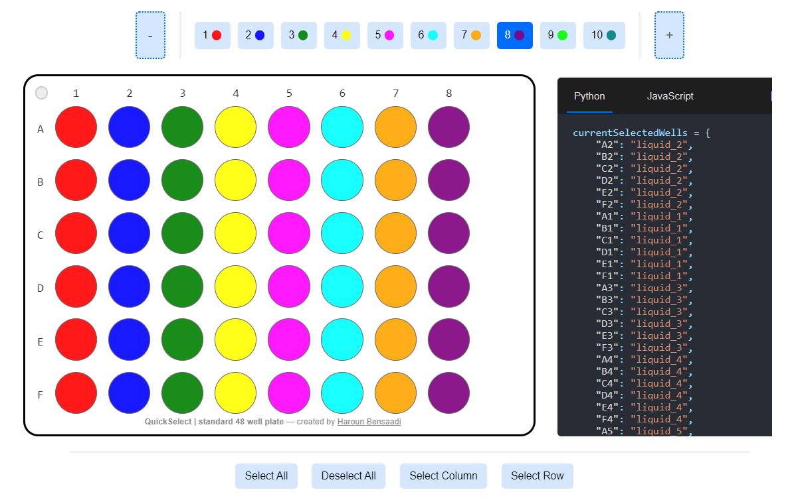

# QuickSelect
A user-friendly interface for simplified well selection across multiple plate configurations in a Python environment.

#### Online Jupyter Notebook

https://nbviewer.org/github/harounbensaadi/QuickSelect/blob/HEAD/notebook.ipynb

Author: Haroun Taki Eddine Bensaadi

Email: hte.bensaadi@gmail.com

### Functionalities

**Various Plate Sizes**: including 6, 12, 24, 48, 96, and 384 well plates.

**Easy Integration**: Embed directly in Jupyter notebooks with a single line of code.

**Drag-to-Select**: Simplifies well selection through intuitive drag interactions.

**Interactive Interface**: Engages users dynamic, responsive layout and intuitive UI.

**Unlimited Liquid Types**: Accommodates any number of liquid types for complex designs.

**Real-Time Layouts**: Shows selected wells dynamically, simplifying experimental visualization.

**Export**: Offers export options in both Python and JavaScript formats.
